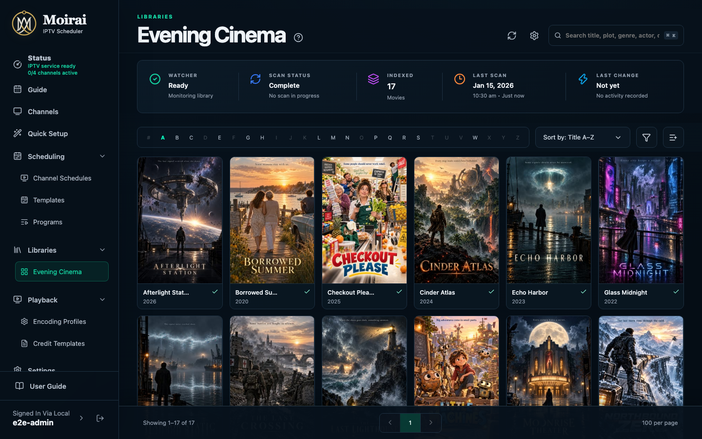
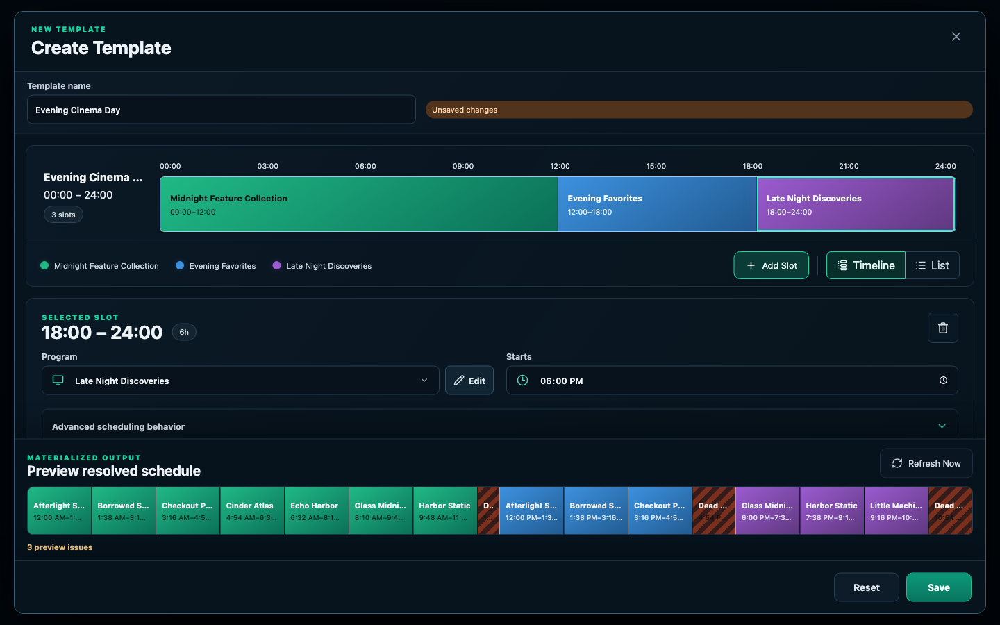
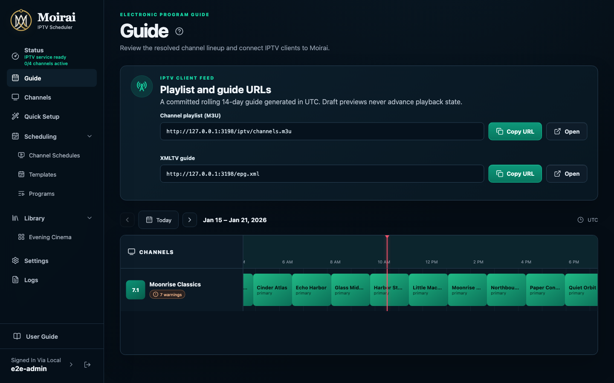

# Moirai

[](https://github.com/moiraitv/moirai/releases/latest)

Moirai turns your personal media library into live TV channels. Browse your movies and shows, build schedules, and watch through an IPTV player. Moirai manages the library and schedule; [ErsatzTV Next](https://github.com/ErsatzTV/next) handles transcoding and playback. It provides an M3U channel playlist and an XMLTV program guide for your player.

> Moirai and ErsatzTV Next are in early development. Expect changes and bugs.

These screenshots use the user guide's simulated library. Click an image to see it at full size.

[](apps/docs/src/public/screenshots/library-catalog.png)

_Browse your media library._

| Build a daily schedule | See what's on |
| --- | --- |
| [](apps/docs/src/public/screenshots/template-editor.png) | [](apps/docs/src/public/screenshots/guide.png) |

## Getting Started

### Docker install

Docker is the simplest way to run Moirai. The image includes the playback engine and media tools. It currently supports `linux/amd64`.

Choose either Docker Compose or a standalone container. Both examples use the same container name and port, so run only one at a time.

#### With Docker Compose

Create a `compose.yaml` file with the following content. Replace `192.168.1.100` with your server's address and `/srv/media` with the folder containing your movies and shows.

```yaml
services:
  moirai:
    image: ghcr.io/moiraitv/moirai:latest
    container_name: moirai
    restart: unless-stopped
    ports:
      - '3000:3000'
    environment:
      MOIRAI_PUBLIC_URL: http://192.168.1.100:3000
      MOIRAI_TIME_ZONE: America/New_York
    volumes:
      - moirai-data:/data
      - /srv/media:/media:ro

volumes:
  moirai-data:
```

Choose your time zone, then run these commands in the folder containing `compose.yaml`:

```sh
docker compose pull
docker compose up -d
```

#### As a standalone container

Replace the server address, time zone, and media folder in this command:

```sh
docker run -d \
  --name moirai \
  --restart unless-stopped \
  --publish 3000:3000 \
  --env MOIRAI_PUBLIC_URL=http://192.168.1.100:3000 \
  --env MOIRAI_TIME_ZONE=America/New_York \
  --mount type=volume,source=moirai-data,target=/data \
  --mount type=bind,source=/srv/media,target=/media,readonly \
  ghcr.io/moiraitv/moirai:latest
```

Docker creates the data volume if it does not exist; the host media folder must already exist. The standalone volume is named `moirai-data`, while Compose normally adds a project prefix. Switching methods does not automatically reuse the same data volume.

#### Open Moirai

With either method, open `http://<server-address>:3000` and create your administrator account before exposing the installation to an untrusted network. Add a library using its container path, such as `/media/movies`. The volume mounted at `/data` keeps your settings and library data between container updates; the media mount is read-only.

`latest` follows stable releases. To stay on one version, replace it with a published version tag from [Releases](https://github.com/moiraitv/moirai/releases). For GPU playback, follow the [hardware acceleration instructions](apps/docs/src/getting-started/docker.md#hardware-acceleration).

To build the image yourself, clone this repository, configure its supplied `compose.yaml`, and run `docker compose up --build -d` from the checkout.

### Configuration

Most installations need only a few settings:

| Setting | What to change |
| --- | --- |
| `MOIRAI_PUBLIC_URL` | The HTTP or HTTPS address your IPTV players can reach, including the port when needed. |
| `MOIRAI_TIME_ZONE` | Your schedule's time zone, such as `America/New_York`. |
| Storage mounts | Keep `/data` persistent and mount your media folders read-only. |
| `MOIRAI_TRUST_PROXY` | If using a reverse proxy, set only the proxy's IP address or network. |

Add environment settings under `environment` in your Compose file. Putting a value in a host `.env` file alone does not pass it into the container; the Compose file must reference or load it. Run `docker compose up -d` after changing the configuration.

For a standalone container, add settings with `--env NAME=value` or load a file with `--env-file .env`. To apply changes, stop and remove the container, then rerun `docker run` with the updated options and the same data volume. Keep the data volume when replacing the container.

**We recommend enabling hardware acceleration that matches your GPU and host** to reduce CPU use during playback. For Docker, give the container access to the GPU, then select a compatible acceleration option in your encoding profile and verify playback. Follow the [hardware acceleration guide](apps/docs/src/getting-started/docker.md#hardware-acceleration) for device access, permissions, and verification.

See the [complete configuration reference](apps/docs/src/operations/configuration.md), [optional transcode storage](apps/docs/src/getting-started/docker.md#optional-transcode-storage), and [first-channel walkthrough](apps/docs/src/getting-started/first-channel.md). The same user guide is available inside Moirai from **User Guide**, or at `http://<server-address>:3000/help/`.

### Local or Logto Authentication

On a new installation, the first visitor creates the local administrator account. Use a long, unique password and complete setup before making the server publicly reachable.

You can also sign in through Logto. Configure `MOIRAI_LOGTO_ENDPOINT`, `MOIRAI_LOGTO_APP_ID`, and `MOIRAI_LOGTO_APP_SECRET`, then follow the [Logto setup instructions](apps/docs/src/getting-started/access.md#set-up-logto). Every user accepted by that Logto application receives full administrator access. A local account can remain available as a fallback.

Sign-in protects administration only. Anyone who can reach the playback endpoints can watch channels, so use network access controls when viewing should be restricted.

If you lose local access, create a single-use recovery link with:

```sh
docker exec moirai npm run auth:reset
```

See [Account and recovery](apps/docs/src/operations/account-and-recovery.md) for more details.

### Local running

To run without Docker, install Git, Node.js 24.8 or newer in the Node 24 release line, FFmpeg with `ffprobe` on your `PATH`, and a Rust toolchain for the playback worker. The commands below use `nvm` to select Node 24.

```sh
git clone https://github.com/moiraitv/moirai.git
cd moirai
nvm use
npm ci
npm run etv:setup
npm run etv:build
```

For a fresh checkout, copy `.env.example` to `.env` and adjust the settings for your server. Keep this file private. `MOIRAI_ETV_CHANNEL_PATH` can point to a compatible prebuilt worker if you do not want to build it with Rust.

For development, run:

```sh
npm run dev
```

Open <http://127.0.0.1:5173>. The development server loads `.env` and reloads the application as you edit it.

For a built local server, stop the development server and run:

```sh
npm run build
node --env-file-if-exists=.env apps/server/dist/main.js
```

Open <http://127.0.0.1:3000> unless you changed the port. This serves the application and bundled guide together. If `.env` sets `MOIRAI_MANAGEMENT_URL` to port 5173, change it to match `MOIRAI_PUBLIC_URL` for this run. See [Contributing](CONTRIBUTING.md#running-developer-instances) for detailed development setup and troubleshooting.

## How to contribute

Feedback, bug reports, and contributions are welcome. [Open an issue](https://github.com/moiraitv/moirai/issues) to report a problem or discuss an idea, and read [Contributing](CONTRIBUTING.md) for development setup, verification commands, and release checks.

The [technical outline](docs/technical-outline.md) describes the architecture and supported features. Moirai is available under the [MIT license](LICENSE).
